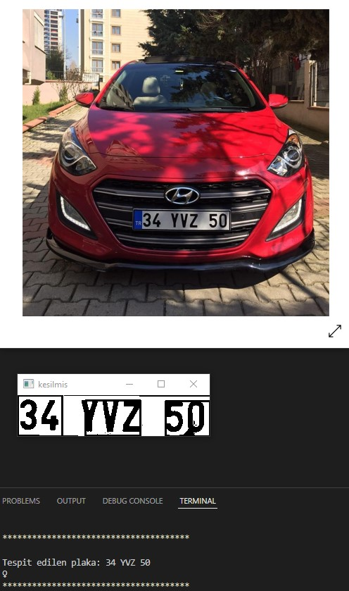

# OpenCV - Pytesseract
- Cv2 kütüphanesi ile fotoğraf algılandı. 
- Morfolojik islemlerle fotoğraf uygun duruma getirildi.
- Plakanın oldugu bölüm kırpıldı.
- Pytesseract ile text stringe dönüstürüldü.
 